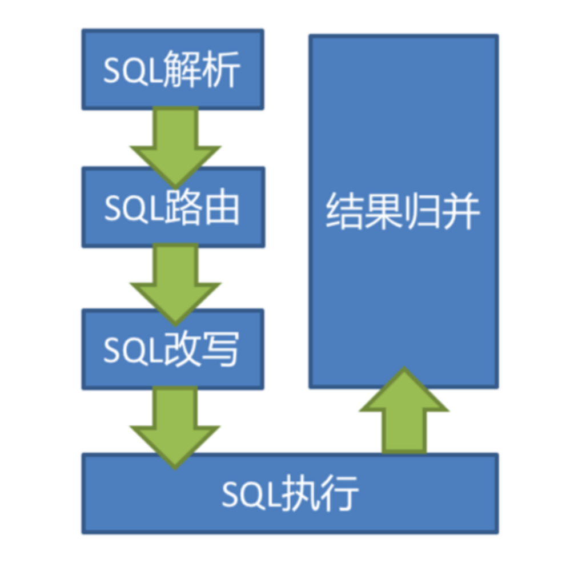
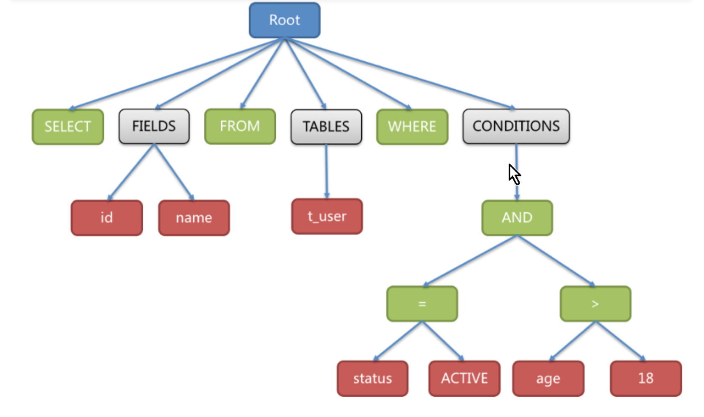
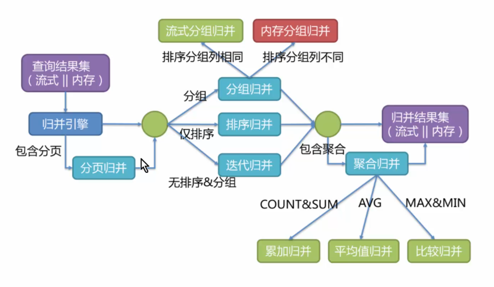

# Sharding-JDBC(2020-04-07)

## 1. 分库分表方式

### 1.1 垂直分表

将一个多字段的大表拆分成两个或多个表，如商品表分为基本信息与详细信息表

### 1.2 垂直分库

按照业务将同类型表放同数据库，如商品相关放一个库 店铺相关放一个库

### 1.3 水平分库

数据量太多，水平将数据划分到不同的库。如用id%2+1存储不同库

### 1.4 水平分表

水平将数据划分到不同的表，同上

## 2. 分库分表带来的问题

### 2.1 事务一致性问题

### 2.2 跨节点关联查询问题

可将原关联查询分为两次查询，第一次查询结果集中找出关联数据id，然后根据id发起第二次请求得到关联数据，最后将获得的数据进行拼装

### 2.3 跨节点分页、排序函数

跨节点多库进行查询时，limit分页、order by排序等问题就变得复杂了。需要先在不同的分片节点中将数据进行排序并返回，然后将不同分片返回的结果集进行汇总和再次排序

### 2.4 主键避重

全局主键 分布式主键

### 2.5 公共表

公共表可以在每个数据库都保存一份，所有对公共表的更新操作都同时发送到所有分库执行

## 3. Sharding-JDBC

### 3.1 Sharding-JDBC介绍

​	当当网开源的分布式数据库中间件，从3.0开始被包含在Sharding-Sphere中，之后进入Apache孵化器，4.0版本之后的为Apache版本

​	ShardingSphere是一套开源的分布式数据库中间件解决方案组成的生态圈，它由Sharding-JDBC、Sharding-Proxy和Sharding-Sidecar(计划中)这三款相互独立的产品组成，他们均提供标准化的数据分片、分布式事务和数据库治理功能，可适用于Java同构、异构语言、容器、云原生等多种多样化的应用场景

​	现在只关注Sharding-JDBC，它定位于轻量级Java框架，在Java的JDBC层提供的额外服务。它使用客户端直连数据库，以jar包形式提供服务，无需额外部署和依赖，可理解为增强版的JDBC驱动，完全兼容JDBC和各种ORM框架

​	Sharding-JDBC的核心功能为**数据分片**和**读写分离**，通过它应用可以透明的使用jdbc访问已经分库分表、读写分离的多个数据源，而不用关心数据源的数量以及数据如何分布

### 3.2 与jdbc性能对比

| 业务场景     | JDBC | Sharding-JDBC1.5.2 | Sharding-JDBC1.5.2/JDBC损耗 |
| ------------ | ---- | ------------------ | --------------------------- |
| 单库单表查询 | 493  | 470                | 4.7%                        |
| 单库单表更新 | 6682 | 6303               | 5.7%                        |
| 单库单表插入 | 6855 | 6375               | 7%                          |

| 业务场景                       | 业务平均响应时间ms | 业务TPS |
| ------------------------------ | ------------------ | ------- |
| jdbc单库单表查询               | 7                  | 493     |
| sharding-jdbc1.5.2单库单表查询 | 8                  | 470     |

jdbc单库两表与sharding-jdbc两库各两表

| 业务场景 | jdbc单库两表 | sharding-jdbc两库各两表 | 性能提升 |
| -------- | ------------ | ----------------------- | -------- |
| 查询     | 1736         | 3331                    | 192%     |
| 更新     | 9170         | 17997                   | 196%     |
| 插入     | 11574        | 23043                   | 199%     |

jdbc单库单表与sharding-jdbc两库各一表对比

| 业务场景 | jdbc单库单表 | sharding-jdbc两库各一表 | 性能提升 |
| -------- | ------------ | ----------------------- | -------- |
| 查询     | 1586         | 2944                    | 185%     |
| 更新     | 9548         | 18561                   | 194%     |
| 插入     | 11182        | 21414                   | 192%     |

1. 性能损耗测试：服务器资源充足、并发数相同，比较JDBC和Sharding-JDBC性能损耗，损耗不超过7%，每秒处理事务量
2. 性能对比测试：服务器资源使用到极限，相同场景JDBC与Sharding-JDBC的吞吐量相当
3. 性能对比测试：服务器资源使用到极限，Sharding-JDBC采用分库分表后，吞吐量较JDBC不分表有接近2倍的提升

## 4. 快速入门

[最新包下载](https://shardingsphere.apache.org/document/current/cn/downloads/)

1. SpringBoot项目中引入starter依赖
2. 分片配置

具体配置参考：[点击查看](https://shardingsphere.apache.org/document/current/cn/manual/sharding-jdbc/configuration/config-spring-boot/)

### 4.1 流程分析

Sharding-JDBC在执行SQL干了什么事：

1. 解析sql，获取分片值
2. 通过规则配置当id为奇数偶数改写sql插入到不同的物理表
3. 执行改写后的真实sql
4. 将所有真正执行sql的结果进行汇总合并返回

执行过程



#### SQL解析

SQL解析过程分为**词法解析**和**语法解析**。词法解析用于将SQL拆解为不可再分的院子符号，称为Token。并根据不同数据库方言所提供的字典将其归类为关键字、表达式、字面量和操作符。再使用语法解析器将SQL转换成抽象语法树。



#### SQL路由

SQL路由是针对**逻辑表**的数据操作映射到对数据节点操作的过程

根据解析上下文匹配数据库和表的分片策略并生成路由。对于携带分片键的SQL，根据分片键操作符不同可以划分为单片路由(分片键的操作符是等号)、多片路由(IN)和范围路由(BETWEEN)，不携带分片键的SQL则采用广播路由。根据分片键进行路由的场景可分为直接路由、标准路由、笛卡尔路由等

标准路由是ShardingJDBC最为推荐使用的分片方式，它的使用范围是不包含关联查询或者仅包含绑定表之间关联查询的SQL。当分片运算符是等号时，路由结果将落入单库(表)，当分片运算符是BETWEEN或IN时，则路由结果不一定落入唯一的库(表)，因此一条逻辑SQL最终可能被拆分为多条用于执行的真实SQL。一个单表查询SQL如下：

```sql
select * from user where user_id in (1, 2);
```

那么路由的结果应为：

```sql
select * from user_0 where user_id in (1, 2);
select * from user_1 where user_id in (1, 2);
```

绑定表的关联查询与单表查询复杂度和性能相当。如一个包含绑定表的关联查询sql如下：

```sql
select * from user u join user_role ur on u.user_id = ur.user_id where user_id in (1, 2);
```

那么路由结果应为：

```sql
select * from user_0 u join user_role_0 ur on u.user_id = ur.user_id where user_id in (1, 2);
select * from user_1 u join user_role_0 ur on u.user_id = ur.user_id where user_id in (1, 2);
```

笛卡尔路由

笛卡尔路由是最复杂的情况，它无法根据绑定表的关系定位分片规则，因此非绑定表之间的关联查询需要拆解为笛卡尔积组合执行。如上个事例，路由结果应为：

```sql
select * from user_0 u join user_role_0 ur on u.user_id = ur.user_id where user_id in (1, 2);
select * from user_0 u join user_role_1 ur on u.user_id = ur.user_id where user_id in (1, 2);
select * from user_1 u join user_role_0 ur on u.user_id = ur.user_id where user_id in (1, 2);
select * from user_1 u join user_role_1 ur on u.user_id = ur.user_id where user_id in (1, 2);
```

笛卡尔路由查询性能较低，需谨慎使用

全库表路由

对于不携带分片键的sql，则采用广播路由的方式。根据sql类型又可以划分为全库表路由、全库路由、全实例路由、单播路由和阻断路由这五种。其中全库表路由用于处理对数据库中与其逻辑表相关的所有真实表的操作，主要包括不带分片键的DQL(数据查询)和DML(数据操纵)以及DDL(数据定义)等

```sql
select * from user where dept_id in (1, 2); 
```

则会遍历所有数据库中的所有表，逐一匹配逻辑表和真实表名，能够匹配得上则执行

```sql
select * from user_0 where dept_id in (1, 2);
select * from user_1 where dept_id in (1, 2);
select * from user_2 where dept_id in (1, 2);
select * from user_3 where dept_id in (1, 2);
```

#### SQL改写

逻辑表改为真实表 排序分页较为复杂

#### SQL执行

采用一套自动化的执行引擎，负责将路由和改写sql安全且高效发送到底层数据源执行。它不是简单地将SQL通过JDBC直接发送至数据源执行，也并非直接将执行请求放入线程池去并发执行。它更关注平衡数据源链接创建以及内存占用所产生的消耗，以及最大限度地合理利用兵法等问题。执行引擎的目的是自动化的平衡资源控制与执行效率，它能在以下两种模式自适应切换：

内存限制模式：对一次操作所消耗的数据库连接数量不做限制。如果实际执行的SQL需要对某数据库实例中的200张表做操作，则对每张表创建一个新的数据库连接，并通过多线程的方式并发处理，以达成执行效率最大化

链接限制模式：使用此模式的前提是ShardingJDBC严格控制对一次操作所消耗的数据库连接数量。如果实际执行的SQL需要对某数据库实例中的200张表做操作，那么只会创建唯一的数据库连接，并对其200张表串行处理。如果一次操作中的分片散落在不同的数据库，仍然采用多线程处理对不同库的操作的操作，但每个库的每次操作仍然只创建一个唯一的数据库连接

内存限制模式适用于OLAP操作，可以通过放宽对数据库连接的限制提升系统吞吐量，连接限制模式适用于OLTP操作，OLTP通常带有分片键，会路由到单一的分片，因此严格控制数据库连接， 以保证在线系统数据库资源能够被更多的应用所使用，是明智的选择

#### 结果归并

将从各数据节点获取的多数据结果集，组合成为一个结果集并正确的返回至请求客户端，成为结果归并。ShardingJDBC支持的结果归并从**功能**上可分为**遍历**、**排序**、**分组**、**分页**和**聚合**5种类型，它们是组合而非互斥的关系

归并引擎的整体结构划分如下图



结果归并从结构划分可分为**流式归并**、**内存归并**和**装饰者归并**。流式归并和内存归并是互斥的，装饰者归并可以在流式归并和内存归并之上做进一步处理

内存归并：将分片结果集的数据遍历并存储在内存中，在通过统一的分组、排序以及聚合等计算之后，将其封装成逐条访问的数据结果集返回

流式归并：是指每一次从数据库结果集中获取到的数据，都能够通过游标逐条获取的方式返回正确的单条数据，它与数据库原生的返回结果集的方式最为契合

装饰者归并：是对所有的结果集归并进行统一的功能增强，比如归并时需要集合SUM前，在进行聚合计算前，都会通过内存归并或流式归并并查询出结果集。因此，聚合归并是在之前介绍的归并类型之上追加的归并能力，即装饰者模式


