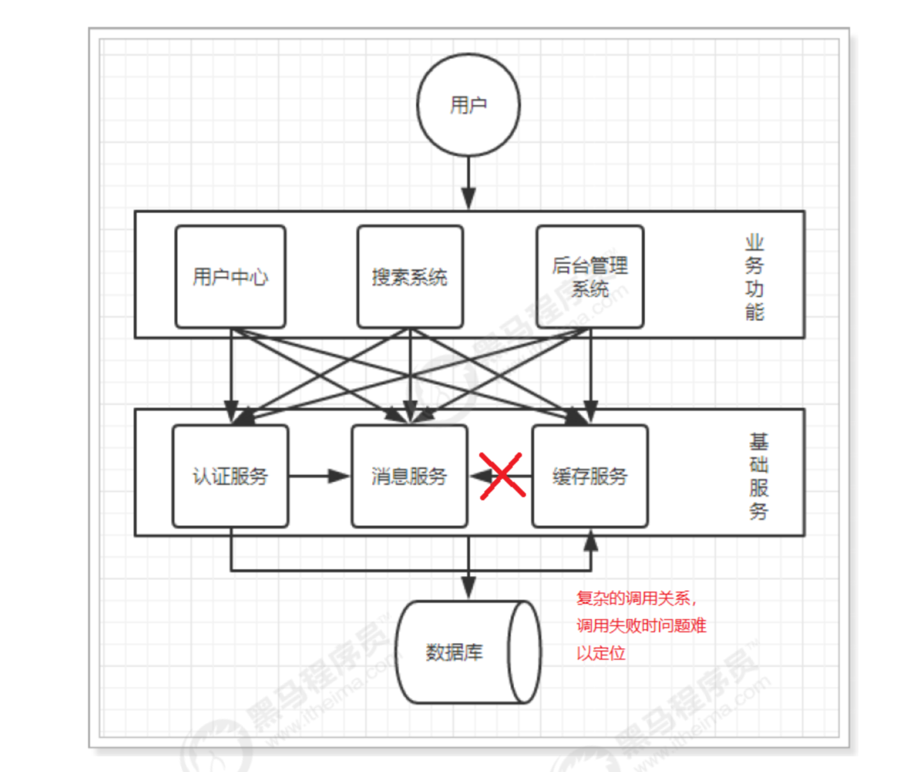
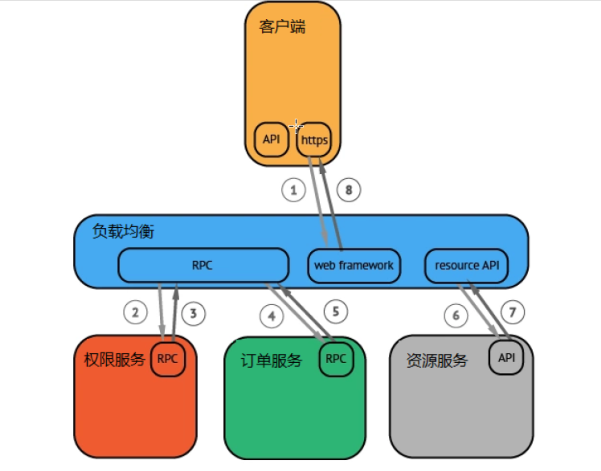
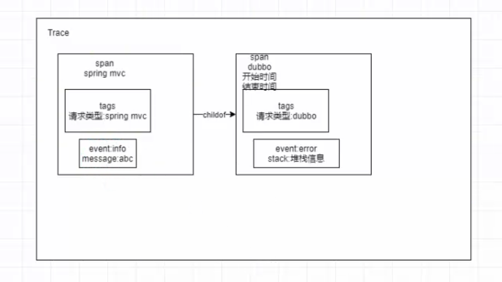
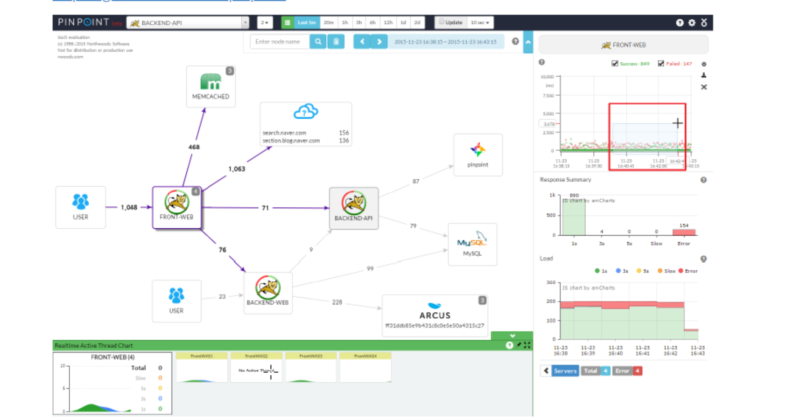
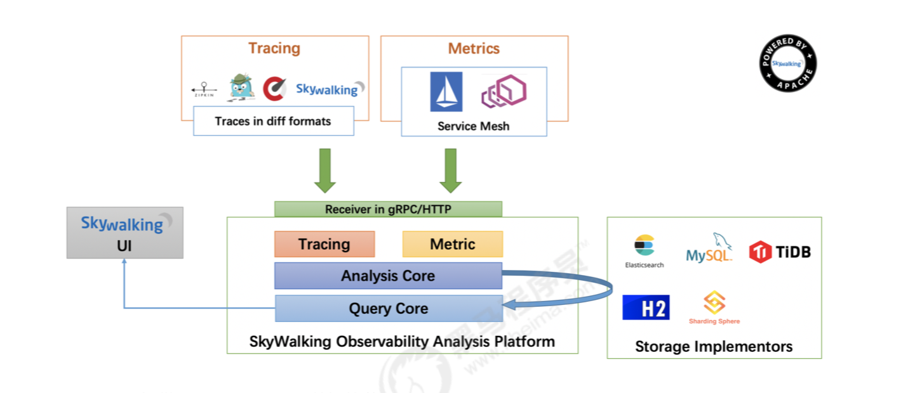
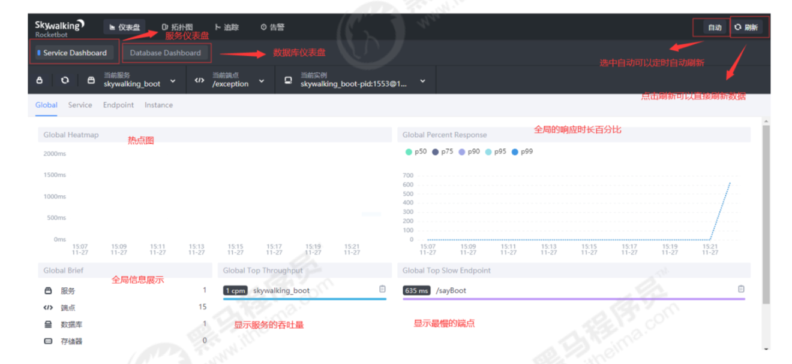

# SkyWalking

## 1. 概述

### 1.1 什么是APM系统

APM(Application Performance Management) 应用性能管理系统，是对企业系统即时监控以实现对应用程序性能管理和故障管理的系统化的解决方案。应用性能管理主要针对企业的关键业务应用进行检测、优化，提高企业应用的可靠性和质量，保证用户得到良好的服务，降低IT总拥有成本。

**APM系统是可以帮助理解系统行为、用于分析性能问题的工具，以便发生故障的时候，能够快速定位和解决问题**

### 1.2 分布式链路追踪

随着分布式系统和微服务架构的出现，一次用户的请求会经过多个系统，不同服务之间的调用关系十分复杂，任何一个系统出错都可能影响整个请求的处理结果。以往的监控系统往往只能知道单个系统的健康状况、一次请求的成功失败，无法快速定位失败的根本原因。



除此之外，复杂的分布式系统也面临这下面这些问题：
性能分析：一个服务依赖很多服务，被依赖的服务也依赖了其他服务。如果某个接口耗时突然变长 了，那未必是直接调用的下游服务慢了，也可能是下游的下游慢了造成的，如何快速定位耗时变长 的根本原因呢? 
链路梳理：需求迭代很快，系统之间调用关系变化频繁，靠人工很难梳理清楚系统链路拓扑(系统之间的调用关系)

**为了解决这些问题，Google 推出了一个分布式链路跟踪系统 ，之后各个互联网公司都参照 Dapper 的思想推出了自己的分布式链路跟踪系统，而这些系统就是分布式系统下的APM系统。**

### 1.3 OpenTracing

#### 什么是OpenTracing

**分布式链路跟踪最先由Google在Dapper论文中提出，而OpenTracing通过提供平台无关、厂商无关的API，使得开发人员能够方便的添加(或更换)追踪系统的实现。**

下图是一个分布式调用的例子，客户端发起请求，请求首先到达负载均衡器，接着经过认证服务，订单服务，然后请求资源，最后返回结果。



虽然这种图对于看清各组件的组合关系是很有用的，但是存在下面两个问题：

* 它不能很好显示组件的调用时间，是串行调用还是并行调用，如果展现更复杂的调用关系，会更加复杂，甚至无法画出这样的图
* 这种图也无法显示调用间的时间间隔以及是否通过定时调用来启动调用

基于OpenTracing我们就可以很轻松的构建出一种更有效的展现一个调用过程的图


#### Trace的概念

在广义上，一个trace代表一个事务或者流程在(分布式)系统中的执行过程。在OpenTrancing标准中，trace是多个span组成的一个有向无环图(DAG)，每一个span代表trace中被命名并计时的连续性的执行片段

例如客户端发起一次请求，就可以认为是一个Trace。上图中每一个色块其实就是一个span

#### span的概念

一个span代表系统中具有开始时间和执行时长的逻辑运行单元。span之间通过嵌套或者顺序排列建立逻辑因果关系

span里面的信息包含：操作的名字，开始时间和结束时间，可以附带多个key:value构成的Tags(key

必须是String，value可以是String、bool或者数字)，还可以附带Logs信息(不一定所有的实现都支持)也是key:value形式

#### Log的概念

每个span可以惊醒多次Logs操作，每一次Logs操作都需要一个带时间戳的时间名称，以及可选的任意大小的存储结构

#### Tags的概念

每个span可以有多个键值对形式的Tags，Tags是没有时间戳的，支持简单的对span进行注解和补充



### 1.4 主流的开源APM产品

* PinPoint

Pinpoint是由一个韩国团队实现并开源，针对Java编写的大规模分布式系统设计，通过JavaAgent的机制做字节代码植入，实现加入traceid和获取性能数据的目的，对应用代码零侵入



* SkyWalking

SkyWalking是apache基金会下面的一个开源APM项目，为微服务架构和云原生架构系统设计。它通过探针自动收集所需的指标，并进行分布式追踪。通过这些调用链路以及指标，Skywalking APM会感知应用间关系和服务间关系，并进行相应的指标统计。Skywalking支持链路追踪和监控应用组件基本涵盖主流框架和容器，如国产RPC Dubbo和motan等，国际化的SpringBoot，SpringCloud

* Zipkin

Zipkin是由Twitter开源，是分布式链路调用监控系统，聚合各业务系统调用延迟数据，达到链路调用监控跟踪。Zipkin基于Google的Dapper论文实现，主要完成数据的收集、存储、搜索与界面展示

* CAT

CAT是由大众点评开源的项目，基于Java开发的实时应用监控平台，包括实时应用监控，业务监控，可以提供十几张报表展示

## 2. 什么是SkyWalking

### 2.1 SkyWalking概述

根据官方的解释，Skywalking是一个可观测性分析平台(Observability Analysis Platform简称OAP) 和应用性能管理系统(Application Performance Management简称APM)。

提供分布式链路追踪、服务网格(Service Mesh)遥测分析、度量(Metric)聚合和可视化一体化解决方案。 下面是Skywalking的几大特点：

* 多语言自动探针，Java、.NET Core和Node.JS
* 多种监控手段，语言探针和service mesh
*  轻量高效，不需要额外搭建大数据平台
*  模块化架构，UI、存储、集群管理多种机制可选
* 支持告警
* 优秀的可视化效果

整体架构如下：



Skywalking提供Tracing和Metrics数据的获取和聚合

> Metric的特点是，它是可累加的：他们具有原子性，每个都是一个逻辑计量单元，或者一个时间 段内的柱状图。 例如:队列的当前深度可以被定义为一个计量单元，在写入或读取时被更新统 计; 输入HTTP请求的数量可以被定义为一个计数器，用于简单累加; 请求的执行时间可以被定 义为一个柱状图，在指定时间片上更新和统计汇总。
>
> Tracing的最大特点就是，它在单次请求的范围内，处理信息。 任何的数据、元数据信息都被绑定 到系统中的单个事务上。 例如:一次调用远程服务的RPC执行过程;一次实际的SQL查询语句; 一次HTTP请求的业务性ID。
>
> 总结，Metric主要用来进行数据的统计，比如HTTP请求数的计算。Tracing主要包含了某一次请 求的链路数据。
>
> 详细的内容可以查看Skywalking开发者吴晟翻译的文章，Metrics, tracing 和 logging 的关系 : http://blog.oneapm.com/apm-tech/811.html

整体架构包含如下三个部分：

1. 探针(agent)负责进行数据的收集，包含了Tracing和Metrics的数据，agent会被安装到服务所在的服务器上，以方便数据的获取
2. 可观测性分析平台OAP(Observability Analysis Platform)，接收探针发送的数据，并在内存中使 用分析引擎(Analysis Core)进行数据的整合运算，然后将数据存储到对应的存储介质上，比如 Elasticsearch、MySQL数据库、H2数据库等。同时OAP还使用查询引擎(Query Core)提供HTTP查 询接口

3. Skywalking提供单独的UI进行数据的查看，此时UI会调用OAP提供的接口，获取对应的数据然后进行展示

### 2.2 SkyWalking优势

Skywalking相比较其他的分布式链路监控工具，具有以下特点：

* 社区相当活跃。Skywalking已经进入apache孵化，目前的start数已经超过12.9K，最新版本7.0.0已经发布。开发者是国人，可以直接和项目发起人交流进行问题的解决
* Skywalking支持Java、.NET Core和Node.JS语言。相对于其他平台比如Pinpoint支持Java和 PHP，具有较大的优势
* 探针无倾入性。对比CAT具有倾入性的探针优势较大。不修改原有项目一行代码就可以进行集成
* 探针性能优秀。有网友对Pinpoint和Skywalking进行过测试，由于Pinpoint收集的数据过多，所以对性能损耗较大，而Skywalking探针性能十分出色
* 支持组件较多。特别是对Rpc框架的支持，这是其他框架所不具备的。Skywalking对Dubbo、 gRpc等有原生的支持，甚至连小众的motan和sofarpc都支持

### 2.3 SkyWalking主要概念介绍

* 服务(Service)
* 端点(Endpoint)
* 实例(Instance)

### 2.4 环境搭建

Skywalking默认使用H2内存中进行数据的存储，我们可以替换存储源为ElasticSearch或Mysql保证其查询的高效及可用性

> 具体的安装步骤可以在Skywalking的官方github上找到
>
>  https://github.com/apache/skywalking/blob/master/docs/en/setup/README.md

百度可以找到更加详细的搭建过程，主要流程 mac系统 如下

1. 启动elasticsearch/mysql
2. 下载SkyWalking包，进入config/application.yml修改数据源
3. 进入bin目录 oapService.sh为后端启动 webappService.sh为前端启动，startup.sh为快捷两个都启动

## 3. Agent的使用

Java agent是在JDK1.5引入的，是一种可以动态修改Java字节码的技术。Java类编译之后形成字节码被JVM执行，JVM在执行这些字节码之前获取这些字节码信息，并且对这些字节码进行修改，来完成一些额外的功能，这种就是Java agent技术。

[详细请看](https://www.cnblogs.com/jackion5/p/10679728.html)

```
+-- agent
    +-- activations
         apm-toolkit-log4j-1.x-activation.jar
         apm-toolkit-log4j-2.x-activation.jar
         apm-toolkit-logback-1.x-activation.jar
         ...
    // 配置文件 
    +-- config
         agent.config
    // 组件的所有插件
    +-- plugins
         apm-dubbo-plugin.jar
         apm-feign-default-http-9.x.jar
         apm-httpClient-4.x-plugin.jar
         .....
    // 可选插件
    +-- optional-plugins
         apm-gson-2.x-plugin.jar
         .....
    +-- bootstrap-plugins
         jdk-http-plugin.jar
         .....
    +-- logs
         skywalking-agent.jar
```

> 部分插件在使用上会影响整体的性能或者由于版权问题放置于可选插件包中，不会自动加载，入要使用，将可选插件中的jar拷贝到plugins包下

由于没有修改agent探针中的应用名，所以默认显示的是Your_ApplicationName。我们修改下应用名称，让他显示的更加正确。编辑agent配置文件：

```shell
cd /usr/local/skywalking/apache-skywalking-apm-bin/agent/config
vi agent.config
```

在配置中找到这一行：

```shell
# The service name in UI
agent.service_name=${SW_AGENT_NAME:Your_ApplicationName}
```

这里的配置含义是可以读取到SW_AGENT_NAME配置属性，如果该配置没有指定，那么默认名称为 Your_ApplicationName。这里我们把Your_ApplicationName替换成skywalking_tomcat。

```shell
# The service name in UI
agent.service_name=${SW_AGENT_NAME:skywalking_tomcat}
```

下面将会使用启动参数的形式动态指定

### 3.1 Tomcat下使用

将war包放置到tomcat/webapps下，编辑`tomcat/bin/catalina.sh`文件，在顶部添加

```shell
CATALINA_OPTS="$CATALINA_OPTS -javaagent:/usr/local/skywalking/apache-
skywalking-apm-bin/agent/skywalking-agent.jar"; export CATALINA_OPTS
```

windows下修改`tomcat/bin/catalina.bat` 顶部添加

```shell
set "CATALINA_OPTS=-javaagent:/path/to/skywalking-agent/skywalking-agent.jar"
```

### 3.2 SpringBoot下使用

```shell
java -javaagent:/usr/local/skywalking/apache-skywalking-apm-
bin/agent_boot/skywalking-agent.jar -Dserver.port=8082 -jar
project.jar &
```

## 4. RocketBot的使用



### 4.1 仪表盘

仪表盘页面分为两大块：

* 服务仪表盘
* 数据库仪表盘

选中服务仪表盘有四个维度：

* 全局，查看全局接口的调用，包括全局响应时长的百分比，最慢的端点，服务的吞吐量等
* 服务，显示服务的响应时长、SLA、吞吐量等信息
* 端点，显示端点的响应时长、SLA、吞吐量等信息
* 实例，显示实例的响应时长、SLA、吞吐量等信息，还可以查看实例的JVM的GC信息、CPU信息、 内存信息

### 4.2 拓扑图

### 4.3 追踪

### 4.4 告警

Skywalking每隔一段时间根据收集到的链路追踪的数据和配置的告警规则(如服务响应时间、服务响应 时间百分比)等，判断如果达到阈值则发送相应的告警信息。发送告警信息是通过调用webhook接口完 成，具体的webhook接口可以使用者自行定义，从而开发者可以在指定的webhook接口中编写各种告 警方式，比如邮件、短信等。告警的信息也可以在RocketBot中查看到

默认配置在config下alarm-settings.yml配置

四种默认规则：

1. 最近3分钟内服务的平均响应时间超过1秒
2. 最近2分钟服务成功率低于80%
3. 最近3分钟90%服务响应时间超过1秒
4. 最近2分钟内服务实例的平均响应时间超过1秒

| 属性           | 含义                                                 |
| -------------- | ---------------------------------------------------- |
| metrics-name   | oal脚本中的度量名称                                  |
| threshold      | 阈值，与metrics-name和下面的比较符号相匹配           |
| op             | 比较操作符，可以设定>,<,=                            |
| period         | 多久检查一次当前的指标数据是否符合告警规则，单位分钟 |
| count          | 达到多少次后，发送告警消息                           |
| silence-period | 在多久之内，忽略相同的告警消息                       |
| message        | 告警消息内容                                         |
| include-names  | 本规则告警生效的服务列表                             |

> webhooks可以配置告警产生时的调用地址

## 5. 常用插件

### 5.1 配置覆盖

#### 系统配置

使用skywalking.+配置文件中的配置名作为系统配置项进行覆盖

* 为什么需要前缀

agent的系统配置和环境与目录应用共享，所以添加前缀避免冲突

* 例子

```shell
-Dskywalking.agent.service_name=skywalking_mysql
```

#### 探针配置

Add the properties after the agent path in JVM arguments

```shell
-javaagent:/path/toskywalking-agent.jar=[option1]=[value1],[option2]=[value2]
```

```shell
-javaagent:/path/to/skywalking-agent.jar=agent.service_name=skywalking_mysql
```

特殊字符如`,` `=`必须用引号包裹起来

#### 系统环境变量

可以在环境变量中设置SW_AGENT_NAME的值来指定服务名

#### 覆盖优先级

探针配置 > 系统配置 >系统环境变量 > 配置文件中的值

### 5.2 获取追踪id

```xml
<!--skywalking trace工具包--> 
<dependency>
    <groupId>org.apache.skywalking</groupId>
    <artifactId>apm-toolkit-trace</artifactId>
    <version>${skywalking.version}</version>
</dependency>
```

```java
// 获取trace id，可以在RocketBot追踪中进行查询
@GetMapping("/getTraceId")
public String getTraceId() {
  // 使当前链路报错，并且提示报错信息
  ActiveSpan.error(new RuntimeException("Test-Error-Throwable"));
  // 打印info信息
  ActiveSpan.info("Test-Info-Msg");
  // 打印debug信息
  ActiveSpan.debug("Test-debug-Msg");
  return TraceContext.traceId();
}
```

使用TraceContext.traceId()可以打印出当前追踪的ID，方便在RocketBot中进行搜索

ActiveSpan提供了三个方法进行信息的打印：

error方法会将本次调用变为失败状态，同时可以打印对应的堆栈信息和错误提示

info方法打印info级别的信息

debug方法打印debug级别的信息

### 5.3 过滤指定的端点

1. 将/agent/optional-plugins/apm-trace-ignore-plugin-6.4.0.jar拷贝到plugins下
2. 启动添加-Dskywalking.trace.ignore_path=/xxx

> 支持表达式 /path/*, /path/**, /path/?
>
> ?匹配任何单字符
>
> *匹配0或者任意数量的字符
>
> **匹配0或者更多的目录

## 6. SkyWalking原理

上文中我们知道，要使用Skywalking去监控服务，需要在其 VM 参数中添加 “- javaagent:/usr/local/skywalking/apache-skywalking-apm-bin/agent/skywalking-agent.jar"。这里就 使用到了java agent技术


Java agent是java命令的一个参数，参数 javaagent 可以用于指定一个 jar 包。

1. 这个 jar 包的 MANIFEST.MF 文件必须指定 Premain-Class 项。
2. Premain-Class 指定的那个类必须实现 premain() 方法。

当Java 虚拟机启动时，在执行 main 函数之前，JVM 会先运行 -javaagent 所指定 jar 包内 Premain- Class 这个类的 premain 方法 


使用 java agent 需要几个步骤:

1. 定义一个 MANIFEST.MF 文件，必须包含 Premain-Class 选项，通常也会加入Can-Redefine- Classes 和 Can-Retransform-Classes 选项

2. 创建一个Premain-Class 指定的类，类中包含premain方法，方法逻辑由用户自己确定
3. 将 premain 的类和 MANIFEST.MF 文件打成 jar 包
4. 使用参数 -javaagent: jar包路径 启动要代理的方法

新建项目添加PreMainAgent类

```java
public class PreMainAgent {
  /**
		* 在这个 premain 函数中，开发者可以进行对类的各种操作。
		* 1、agentArgs 是 premain 函数得到的程序参数，随同 “– javaagent”一起传入。与main函数不同的是，这个参数是一个字符串而不是一个字符串数组，如果程序参数有多个，程序将自行解析这个字符串。 
		* 2、Inst 是一个 java.lang.instrument.Instrumentation 的实例，由 JVM 自动传入。 
		* java.lang.instrument.Instrumentation 是 instrument 包中定义的一个接口，也是这个包的核心部分，
		* 集中了其中几乎所有的功能方法，例如类定义的转换和操作等等。
		*/
  public static void premain(String agentArgs, Instrumentation inst) {
    System.out.println("=========premain方法执行1========");
    System.out.println(agentArgs);
  }
  
  /**
		* 如果不存在 premain(String agentArgs, Instrumentation inst) * 则会执行premain(String agentArgs)
		* @param agentArgs
		*/
	public static void premain(String agentArgs) {
    System.out.println("=========premain方法执行2========");
    System.out.println(agentArgs);
	}
}
```

> 类中提供两个静态方法，方法名均为premain，不能拼错

在pom文件中添加打包插件

```xml
<plugins>
	<plugin>
    <artifactId>maven-assembly-plugin</artifactId>
    <configuration>
        <appendAssemblyId>false</appendAssemblyId>
        <descriptorRefs>
            <descriptorRef>jar-with-dependencies</descriptorRef>
        </descriptorRefs>
        <archive>
          <!-- 自动添加META-INF/MANIFEST.MF --> 
          <manifest>
                <addClasspath>true</addClasspath>
            </manifest>
            <manifestEntries>
                <Premain-Class>PreMainAgent</Premain-Class>
                <Agent-Class>PreMainAgent</Agent-Class>
                <Can-Redefine-Classes>true</Can-Redefine-Classes>
                <Can-Retransform-Classes>true</Can-Retransform-
            </manifestEntries>
        </archive>
    </configuration>
    <executions>
        <execution>
            <id>make-assembly</id>
            <phase>package</phase>
            <goals>
                <goal>single</goal>
            </goals>
        </execution>
     </executions>
   </plugin>
</plugins>
```

> 该插件会在自动生成META-INF/MANIFEST.MF文件时，帮我们添加agent相关的配置信息

打包 然后像使用skywalking一样启动项目添加自己的探针

### 6.1 统计方法调用时间

Skywalking中对每个调用的时长都进行了统计，这一小节中我们会使用ByteBuddy和Java agent技术来 统计方法的调用时长。Byte Buddy是开源的、基于Apache 2.0许可证的库，它致力于解决字节码操作和instrumentation API 的复杂性。Byte Buddy所声称的目标是将显式的字节码操作隐藏在一个类型安全的领域特定语言背后。通过使用Byte Buddy，任何熟悉Java编程语言的人都有望非常容易地进行字节码操作。Byte Buddy提供了额外的API来生成Java agent，可以轻松的增强我们已有的代码

添加依赖：

```xml
<dependencies>
    <dependency>
        <groupId>net.bytebuddy</groupId>
        <artifactId>byte-buddy</artifactId>
        <version>1.9.2</version>
    </dependency>
    <dependency>
        <groupId>net.bytebuddy</groupId>
        <artifactId>byte-buddy-agent</artifactId>
        <version>1.9.2</version>
    </dependency>
</dependencies>
```

修改PreMainAgent代码：

```java
public class PreMainAgent {
	public static void premain(String agentArgs, Instrumentation inst) {
    //创建一个转换器，转换器可以修改类的实现
    //ByteBuddy对java agent提供了转换器的实现
    AgentBuilder.Transformer transformer = new AgentBuilder.Transformer() {
            public DynamicType.Builder<?> transform(DynamicType.Builder<?>
builder, TypeDescription typeDescription, ClassLoader classLoader, JavaModule javaModule) {
	return builder
	// 拦截任意方法
	.method(ElementMatchers.<MethodDescription>any())
	// 拦截到的方法委托给TimeInterceptor
	.intercept(MethodDelegation.to(MyInterceptor.class));
            }
    };
    // Byte Buddy专门有个AgentBuilder来处理Java Agent的场景
    new AgentBuilder.Default()
    // 根据包名前缀拦截类 拦截到的类由transformer处理
     .type(ElementMatchers.nameStartsWith("com.agent")) 
     .transform(transformer).installOn(inst);
	}
}


--------------
  
public class MyInterceptor {
  	@RuntimeType
  	public static Object intercept(@Origin Method method, @SuperCall Callable<?> callable) throws Excetion {
      Long start = Sysytem.currentTimeMillis();
      try {
        return callable.call();
      } finally {
        System.out.println(method.getName() + ":" + (System.currentTimeMillis() - start) + "ms");
      }
    }
}
```

